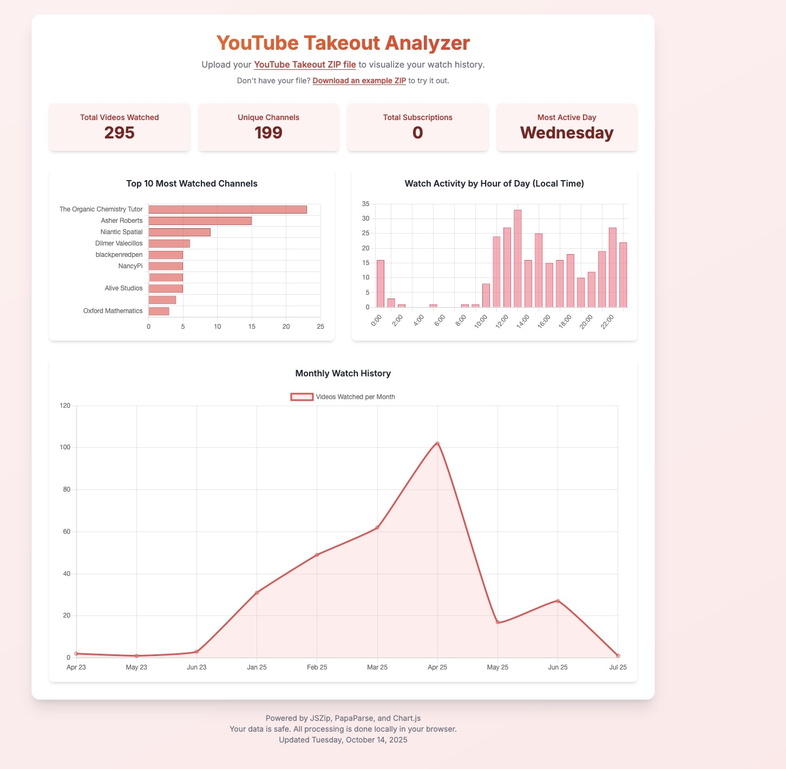

# Youtube Takeout Analyzer

Analyze the takeout zip specifically for youtube within the browser.

# URL [`Webapp`]()

## Important note 

Most of the functionality is done. However, it is still under construction.

Features added:
- Subscriptions
- Top 10 most watched channels
- Unique channels
- Total videos watched
- Total subscriptions
- Most active day

Features not completed:
- Raw data querying
- Subscriber viewing
- Testing
- Other products 
- Exporting

## How to use

Just upload the zip file from takeout.google and your all good no format changes
